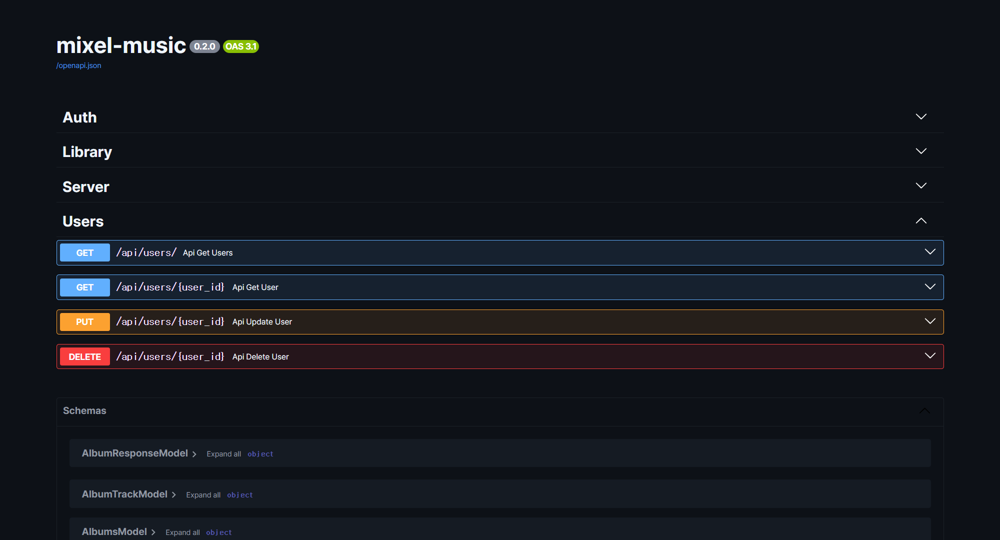

## Setup
```python
from fastapi.responses import HTMLResponse
from fastapi.openapi.docs import get_swagger_ui_html
from fastapi.staticfiles import StaticFiles

app = FastAPI(docs_url=None)
app.mount("/static", StaticFiles(directory='static'), name="static")

@app.get("/docs", include_in_schema=False)
async def custom_swagger_docs() -> HTMLResponse:
    return get_swagger_ui_html(
        openapi_url=app.openapi_url,
        title=f'{app.title} - Swagger UI',
        swagger_css_url='/static/dark.css',
    )
```